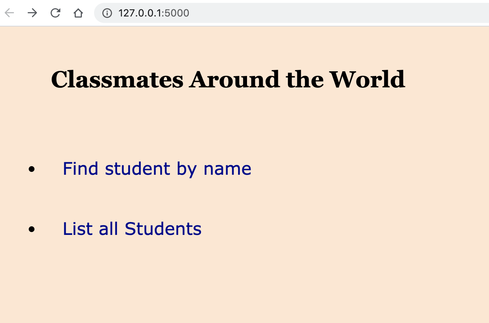
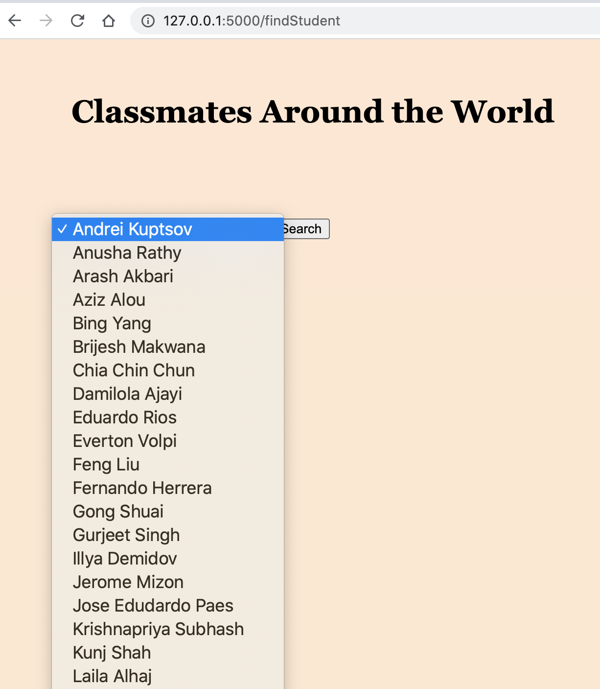
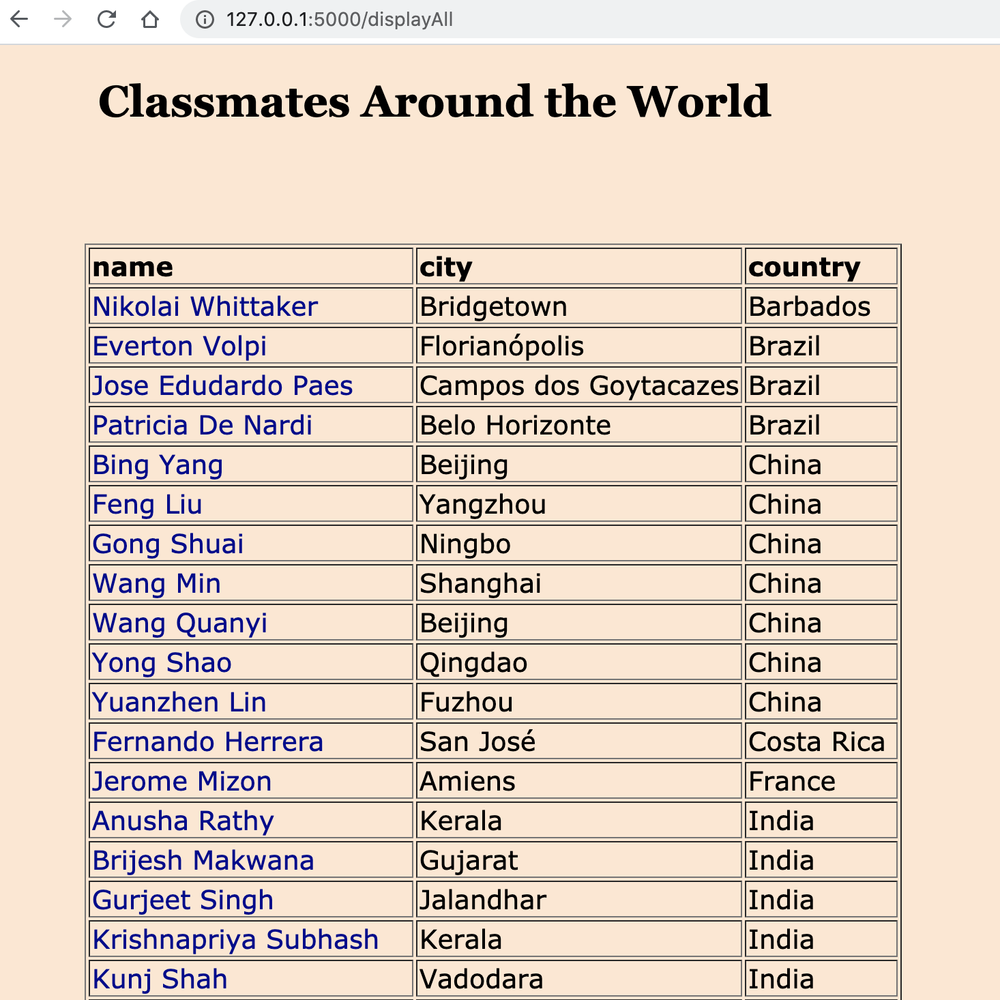
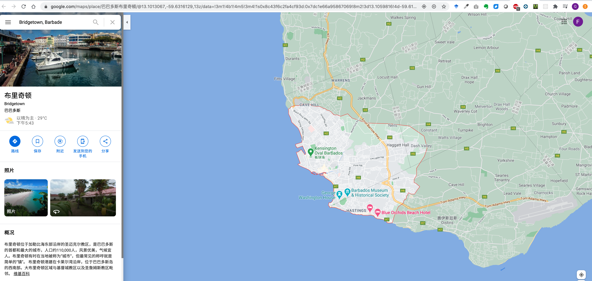

# ClassmatesAroundTheWorld
python project with flask
Using Pycharm, create a flask application with three routes:
Option 1 of the menu is used to display the Google map of the city of a specific student.
Option 2 of the menu displays a table of all students, country and cities.

# Images In ReadMe

